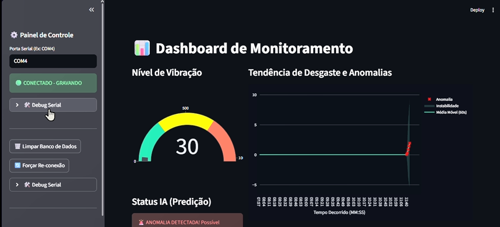

# PiezoVision: Monitoramento Preditivo de Vibração Industrial

PiezoVision é uma solução completa para monitoramento de saúde de máquinas industriais utilizando sensores piezoelétricos e inteligência artificial. O sistema coleta dados de vibração em tempo real, detecta anomalias utilizando Machine Learning e gera relatórios detalhados para manutenção preditiva.

 *(Nota: Adicione seu screenshot aqui)*

## 🚀 Funcionalidades

- **Monitoramento em Tempo Real**: Coleta de dados via Serial (Arduino/ESP32) com visualização instantânea.
- **Detecção de Anomalias (IA)**: Utiliza o algoritmo *Isolation Forest* para identificar padrões de vibração irregulares que indicam desgaste ou falha iminente.
- **Dashboards Duplos**:
  - **Interface Web Premium**: Dashboard moderno com Three.js (fundo 3D), Chart.js e visualização de múltiplos históricos.
  - **Streamlit Dashboard**: Interface administrativa focada em controle serial e análise rápida.
- **Estabilidade e Performance**: Banco de dados configurado em modo **WAL (Write-Ahead Logging)**, permitindo leitura e escrita simultâneas.
- **Gestão de Dados**: Armazenamento em SQLite e botão de **Backup Manual** para exportação para CSV.
- **Relatórios Automatizados**: Geração de relatórios HTML com análise de anomalias por IA.

## 🛠️ Tecnologias Utilizadas

- **Backend**: Python, FastAPI, Uvicorn.
- **Frontend**: HTML5, CSS3 (Vanilla), JavaScript (ES6+), Three.js, Chart.js.
- **Análise de Dados**: Pandas, Scikit-Learn (Isolation Forest), Plotly.
- **Dashboard Admin**: Streamlit.
- **Banco de Dados**: SQLite3.
- **Comunicação**: PySerial.

## 📂 Estrutura do Projeto

```text
piezo/
├── app.py              # Dashboard Streamlit (Controle e Leitura Serial)
├── server.py           # API FastAPI (Servidor da Interface Web e Relatórios)
├── analise_ml.py       # Lógica de Machine Learning e Geração de Relatórios
├── dados_sensor.db     # Banco de Dados SQLite (Histórico em Tempo Real)
├── web/                # Interface Web Premium (HTML/CSS/JS)
├── relatorios/         # Pasta onde os relatórios gerados pela IA são salvos
├── backups/            # Pasta de exportações CSV automáticas
└── requirements.txt    # Dependências do Python
```

## ⚙️ Como Instalar e Rodar

### 1. Requisitos
- Python 3.8+
- Arduino ou simulador conectado via Serial (padrão: COM4)

### 2. Instalação
Clone o repositório e instale as dependências:
```bash
pip install -r requirements.txt
```

### 3. Execução

O sistema possui dois componentes principais que devem rodar simultaneamente:

**A. Dashboard de Controle e Leitura Serial (Streamlit):**
```bash
streamlit run app.py
```
*Acesse em: `http://localhost:8501`*

**B. Servidor da API e Interface Web (FastAPI):**
```bash
python server.py
```
*Acesse em: `http://localhost:8000`*

## 🤖 Como funciona a Detecção de Falhas?

O sistema utiliza o algoritmo **Isolation Forest**. Ao contrário de modelos tradicionais, ele não precisa de "exemplos de erro" para aprender. Ele isola observações que são estatisticamente diferentes do padrão normal de vibração da máquina (baseando-se em média móvel, desvio padrão e picos de impacto). Quando uma anomalia é detectada, ela é marcada com um **'X' vermelho** nos gráficos.

## 📄 Licença

Este projeto foi desenvolvido para fins de monitoramento industrial preditivo. Sinta-se à vontade para expandir!

---
Desenvolvido com ❤️ para a indústria 4.0.
